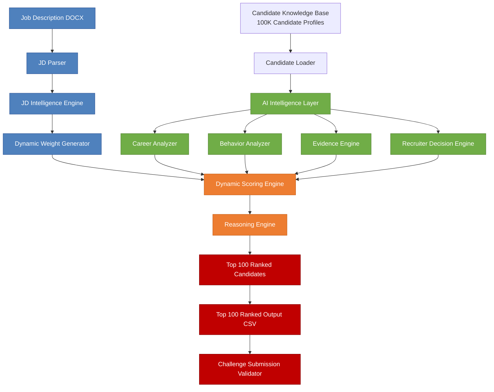

```mermaid
flowchart TD

    A[Job Description DOCX]
    B[JD Parser]
    C[JD Intelligence Engine]
    D[Dynamic Weight Generator]

    E[Candidate Knowledge Base<br/>100K Candidate Profiles]
    F[Candidate Loader]

    AI[AI Intelligence Layer]

    G[Career Analyzer]
    H[Behavior Analyzer]
    I[Evidence Engine]
    J[Recruiter Decision Engine]

    K[Dynamic Scoring Engine]
    L[Reasoning Engine]
    M[Top 100 Ranked Candidates]
    N[Top 100 Ranked Output CSV]
    O[Challenge Submission Validator]

    A --> B
    B --> C
    C --> D

    E --> F

    F --> AI

    AI --> G
    AI --> H
    AI --> I
    AI --> J

    D --> K
    G --> K
    H --> K
    I --> K
    J --> K

    K --> L
    L --> M
    M --> N
    N --> O

    classDef jd fill:#4F81BD,color:#fff,stroke:#2F5597;
    classDef ai fill:#70AD47,color:#fff,stroke:#548235;
    classDef scoring fill:#ED7D31,color:#fff,stroke:#C55A11;
    classDef output fill:#C00000,color:#fff,stroke:#7F0000;

    class A,B,C,D jd;
    class AI,G,H,I,J ai;
    class K,L scoring;
    class M,N,O output;
```